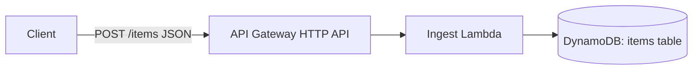

# CCE Tech Challenge

Minimal serverless app for the MAN Digital Hub / CCE tech challenge.

## Architecture



- **API Gateway (HTTP API)** exposes `POST /items`.
- **Ingest Lambda** (`src/ingest_handler.py`) validates the JSON body, generates an id, and writes the item to DynamoDB.
- **DynamoDB** (`items` table, on-demand billing) is the datastore.

Everything is defined in plain [CloudFormation](template.yaml) (no CDK/SAM transform), and fits in the AWS Free Tier.

## Deploying

Prerequisites: an AWS account/credentials configured (`aws configure` / `aws sso login`), and `zip` installed.

```bash
# 1. Package the Lambda source into a zip artifact and upload it to an S3 bucket
export ARTIFACT_BUCKET=my-cce-challenge-artifacts   # must already exist, or create one first
cd src
zip ingest.zip ingest_handler.py
cd ..
aws s3 cp src/ingest.zip "s3://$ARTIFACT_BUCKET/ingest.zip"

# 2. Deploy the stack
aws cloudformation deploy \
  --template-file template.yaml \
  --stack-name cce-tech-challenge \
  --capabilities CAPABILITY_NAMED_IAM \
  --parameter-overrides \
      CodeBucket="$ARTIFACT_BUCKET" \
      IngestCodeKey=ingest.zip

# 3. Get the API endpoint
aws cloudformation describe-stacks \
  --stack-name cce-tech-challenge \
  --query "Stacks[0].Outputs"
```

## Trying it out

```bash
curl -X POST "$API_ENDPOINT/items" \
  -H "Content-Type: application/json" \
  -d '{"name": "example item", "value": 42}'
```

Each call creates one item in the `items` DynamoDB table.

## Cleaning up

```bash
aws cloudformation delete-stack --stack-name cce-tech-challenge
```

## CI/CD approach

Kept intentionally simple, a small GitLab pipeline (`.gitlab-ci.yml`) with 3 stages:

1. **Test** — run `pytest` on the Lambda handlers and `cfn-lint` on `template.yaml`, on every push/merge request.
2. **Package** — zip the Lambda source file and upload it to the artifact S3 bucket (same commands as in "Deploying" above), tagged with the commit SHA so each build is traceable.
3. **Deploy** — run `aws cloudformation deploy` against the AWS account, using AWS credentials stored as protected GitLab CI/CD variables. Restrict this stage to the `main` branch so only merged code gets deployed.

That's the whole flow: push code → tests run → artifact is packaged → stack is deployed automatically on `main`. For a real production setup I'd later add a manual approval step before deploying and split it into separate dev/prod stages, but for this challenge one environment and one deploy step is enough to demonstrate the idea.
